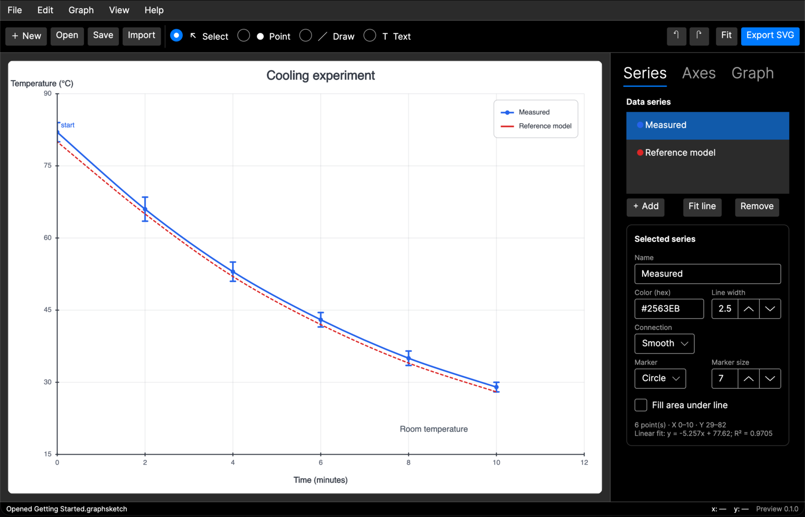

# GraphSketcher for Linux

[](https://github.com/Jacoba1100254352/GraphSketcher.Linux/actions/workflows/ci.yml)


An independent, open-source Linux port of
[GraphSketcher](https://github.com/graphsketcher/GraphSketcher): a fast,
direct-manipulation app for sketching graphs and plotting tabular data.

> **Project status:** Early preview (`0.1.0-preview.1`). The graphing workflow is
> useful now, but this is not yet full feature parity with the original Mac and
> iPad application. This community port is not endorsed by the original
> maintainers.



## What works

- Native Avalonia UI on X11 and Wayland desktops, with light and dark themes
- Point, straight-line, smooth-line, and area plots
- Direct point creation, selection, dragging, and deletion
- CSV/TSV text and pasted spreadsheet data import
- Multiple editable series, colors, markers, line styles, and error bars
- Linear best-fit lines with slope, intercept, and R²
- Linear and logarithmic axes, grid/tick controls, and automatic scaling
- Labels, legend, axis titles, graph title, undo, and redo
- Validated `.graphsketch` JSON documents shared with the Windows port
- Import of plain-XML and zipped legacy `.ograph` files
- SVG and CSV export
- Self-contained Linux x64 and ARM64 tarballs and Debian packages
- x64 AppImage for distribution-independent use
- XDG desktop menu, icon, AppStream metadata, and file-type registration

See [the compatibility matrix](docs/COMPATIBILITY.md) for exact legacy
`.ograph` coverage and known gaps.

## Download

Releases are published on the
[GraphSketcher.Linux releases page](https://github.com/Jacoba1100254352/GraphSketcher.Linux/releases).

- **AppImage (x64):** download, run
  `chmod +x GraphSketcher-Linux-*.AppImage`, and open it.
- **Debian/Ubuntu:** install the matching `amd64` or `arm64` `.deb` with
  `sudo apt install ./GraphSketcher-Linux-*.deb`.
- **Portable:** extract the matching `linux-x64` or `linux-arm64` tarball and
  run `./GraphSketcher`.

Packages are self-contained and do not require a separate .NET installation.
The desktop still needs ordinary system graphics, font, X11/Wayland, and
desktop-portal libraries.

## Build from source

Requirements:

- .NET 10 SDK
- A supported Linux desktop session
- Common Avalonia native libraries (X11, fontconfig, freetype, OpenGL, and
  D-Bus)

```bash
dotnet restore GraphSketcher.Linux.sln
dotnet test GraphSketcher.Linux.sln -c Release
dotnet run --project src/GraphSketcher.App
```

Create a self-contained x64 build:

```bash
dotnet publish src/GraphSketcher.App \
  -c Release \
  -r linux-x64 \
  --self-contained true \
  -o artifacts/publish-linux-x64
```

See [Linux packaging](packaging/README.md) for reproducible package commands.

## Architecture

- `GraphSketcher.Core` — platform-neutral graph model, math, data import,
  serializers, legacy `.ograph` compatibility, and vector export
- `GraphSketcher.App` — Avalonia UI and interactive renderer
- `GraphSketcher.Core.Tests` — model, security-boundary, and compatibility tests
- `packaging/linux` — XDG integration and Linux package metadata

The portable core and initial Avalonia UI are based on
[GraphSketcher.Windows](https://github.com/Jacoba1100254352/GraphSketcher.Windows).
Linux-specific runtime settings, packaging, smoke tests, and release automation
live here.

## Attribution and license

Graph Sketcher was created by Robin Stewart in 2007 and further developed by
The Omni Group. The original source was released in 2014 under the MIT-style
Omni Source License 2007.

See [NOTICE.md](NOTICE.md) for complete attribution and the independent-port
disclaimer, and [THIRD-PARTY-NOTICES.md](THIRD-PARTY-NOTICES.md) for bundled
runtime and library notices. This repository is distributed under the terms in
[LICENSE](LICENSE).
